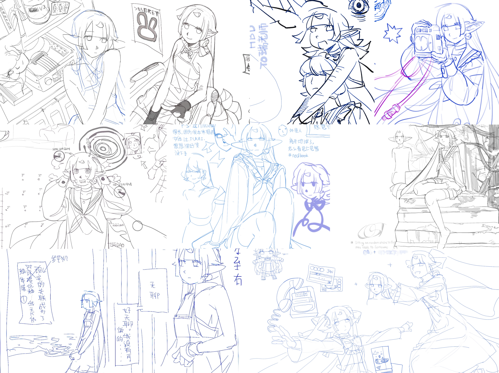
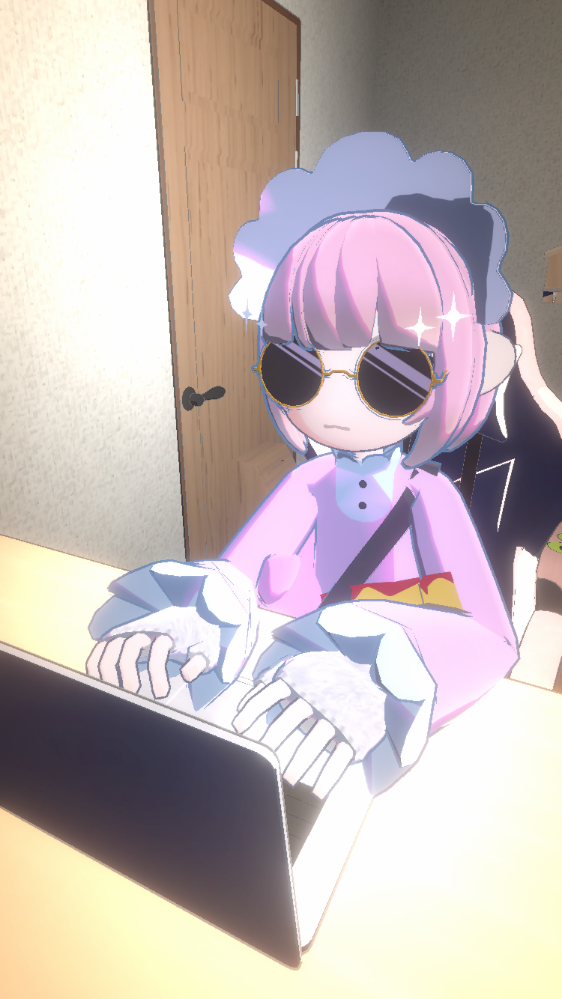
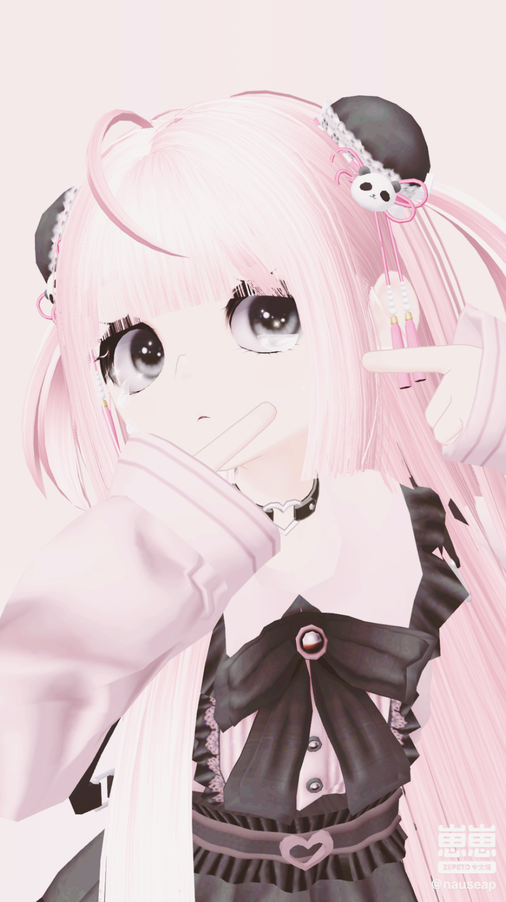
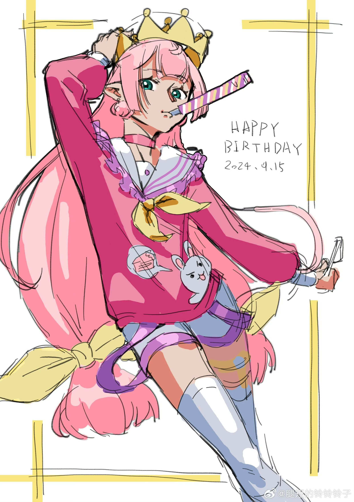
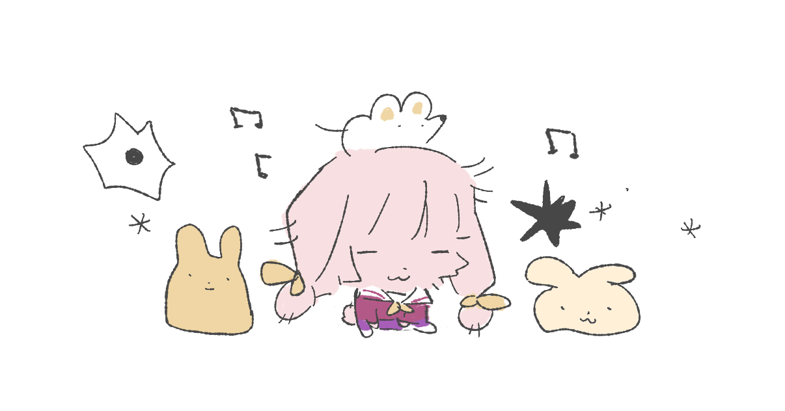

# 上原托马斯

**角色简介**

托马斯是一名人类女孩&前魔法少女，混极少的精灵血统。TMS16 岁时成为“魔法少女”（她被天使化的自己诱骗，将灵魂存入魂器，最终没有俸禄饿死在混乱大陆，分裂，成为活死人也就是 18 岁时），17 岁离家出走混乐队，18 岁成为活死人被 hsn 捡回税务局，如今在税务局生活了 3 年，每天的工作是帮 hsn 查档（卧槽盒，但是数据是 HSN 用米歇尔的军方外挂薅的，tms 只要查个数据库就行了）和总结任务信息。偶尔会被抓去围观 hsn 砍人，由于星野有时做任务手段比较极端，偶尔会被米要求去帮 hsn 收尸（把半死不活的 hsn 搬回家里）。

名字像男名，是因为父母希望她如男孩一般，而当女孩需要承受许多偏见。同时，托马斯有精灵耳，这其实是返祖现象，但是父母都不知道自己家族谱系有精灵血统，因此 tms 遭受了许多家庭小矛盾。
托马斯成长于青河大陆的西郊区，父亲是一名商人兼艺术家，母亲则是一位职场女性。尽管家庭氛围整体幸福，但偶尔的误解与矛盾始终让她感到不安。她的“芯片过适应病”让她在网络空间中获得更强的真实感，使得她在虚拟世界中游刃有余，但却也使她逐渐与现实产生了隔阂，但是她有一些很真挚的好友，这令她有实感，所以她非常看重和朋友的友情。

现在的阶段是，托马斯在经历了和 hsn 等人的夏日度假后，已经完全混入了 hsn 的茶友小团体。
-Hsn 的小团体：hsn 的邻居涟漪，hsn 的男友米歇尔，hsn 的茶友楽，其实是米歇尔提议要让 hsn 多招待一下朋友，担心 hsn 太寂寞而形成的，每个人都很溺爱 hsn，虽然涟漪是一名毒妇（无意识地嘴恶，但是至少性格很飒爽，而且年龄很大）
TMS 最近正在陷入自我认知的困境。

|上原_托马斯/Uehara_Thomas ||||
| :---------------------------------------------------------------------------------------------------------------------------------------: | :-----------------------------------------------: | --------------------| --------------------|
|​​||||
|||||
|||||
|||||
|||||
|||||
|||||
|||||
|||||
|||||
|基本信息 ||||
|本名|上原托马斯 |||
|昵称|TMS、~~爱与梦想~~ |||
|发色|浅金色/粉色 |||
|瞳色|蓝色/青绿色 |||
|人种|冻土苔原人种/精灵种 |||
|身高|165cm |||
|年龄|22 岁 |||
|生日|6 月 15 日 |||
|相关人士 ||||
|友人|友人 A、友人 B、米歇尔 |||
|领养者|[星野涙人](星野涙人.md)|||
|乐队成员|zc1、gs1、jp1 |||
|异构体|[电脑娘](上原托马斯/同分异构体们/电脑娘.md)、Lily、nostalgia|||
|家人|托马斯父、托马斯母|||

> ​​​的照片墙
>
> 

> 
> 内含：约稿/捏人/……本页面已对不同面相网骗高P等无端指责签署免责协议
> 

>
> ​​​
>
> ​​​
>
> ​​​​​
>
> ​​​
>
> ​​​

‍

[更多链接](上原托马斯/更多链接.md)

‍
